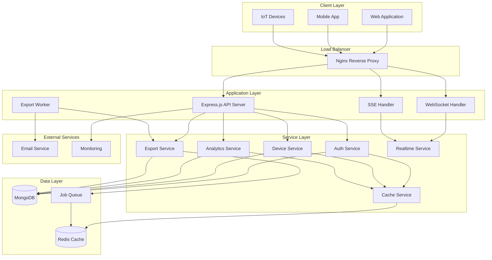

# System Architecture

## Overview

The Advanced Smart Device Management Backend is built using a microservices-inspired architecture with clear separation of concerns, comprehensive caching strategies, and real-time communication capabilities.

## High-Level Architecture



## Component Architecture

### 1. API Gateway Layer

#### Nginx Reverse Proxy
- **Purpose**: Load balancing, SSL termination, rate limiting
- **Features**:
  - Request routing based on path patterns
  - Static file serving for exports
  - WebSocket proxy support
  - Security headers injection
  - Request/response logging

#### Express.js Application
- **Purpose**: Main API server handling HTTP requests
- **Middleware Stack**:
  1. Security headers (Helmet)
  2. CORS configuration
  3. Request parsing (JSON/URL-encoded)
  4. IP tracking and request ID generation
  5. Performance logging
  6. Authentication verification
  7. Rate limiting (differentiated by endpoint)
  8. Route handling
  9. Error handling and structured responses

### 2. Service Layer Architecture

#### Authentication Service
```javascript
class AuthService {
  // Token management
  generateTokens(user)
  verifyToken(token, type)
  rotateTokens(refreshToken)
  blacklistToken(token)
  
  // User management
  createUser(userData)
  authenticateUser(credentials)
  updateUserProfile(userId, updates)
}
```

**Responsibilities**:
- JWT token generation and validation
- Refresh token rotation and blacklisting
- User authentication and authorization
- Account security (lockout, rate limiting)

#### Device Service
```javascript
class DeviceService {
  // Device CRUD operations
  createDevice(deviceData)
  getDevices(userId, filters)
  updateDevice(deviceId, updates)
  deleteDevice(deviceId)
  
  // Device monitoring
  recordHeartbeat(deviceId, status)
  getDeviceStatus(deviceId)
  deactivateInactiveDevices()
}
```

**Responsibilities**:
- Device lifecycle management
- Heartbeat monitoring and status tracking
- Owner-based access control
- Device analytics data collection

#### Analytics Service
```javascript
class AnalyticsService {
  // Dashboard analytics
  getDashboardData(userId, dateRange)
  getDeviceComparison(userId, deviceIds)
  getRealTimeStats(userId)
  
  // Usage analytics
  getDeviceUsage(deviceId, dateRange)
  getUsageTrends(userId, dateRange)
  getEventDistribution(userId, dateRange)
}
```

**Responsibilities**:
- Real-time analytics computation
- Usage trend analysis
- Performance metrics aggregation
- Dashboard data preparation

#### Export Service
```javascript
class ExportService {
  // Export operations
  exportDeviceLogs(config)
  generateUsageReport(config)
  createExportJob(userId, config)
  
  // File management
  getExportFile(filename)
  deleteExportFile(filename)
  cleanOldExports(maxAge)
}
```

**Responsibilities**:
- Asynchronous data export processing
- Multiple format support (CSV, JSON)
- Large dataset handling with streaming
- Export file lifecycle management

### 3. Data Layer Architecture

#### MongoDB Database Design

**Collections Structure**:

```javascript
// Users Collection
{
  _id: ObjectId,
  name: String,
  email: String (indexed, unique),
  password: String (hashed),
  role: String,
  refreshTokens: [{
    token: String,
    expiresAt: Date,
    createdAt: Date,
    userAgent: String,
    ip: String
  }],
  lastLoginAt: Date,
  loginAttempts: Number,
  lockUntil: Date,
  createdAt: Date,
  updatedAt: Date
}

// Devices Collection
{
  _id: ObjectId,
  name: String,
  type: String,
  status: String,
  last_active_at: Date,
  owner_id: ObjectId (indexed),
  createdAt: Date,
  updatedAt: Date
}

// Logs Collection
{
  _id: ObjectId,
  device_id: ObjectId (indexed),
  event: String,
  value: Number,
  timestamp: Date (indexed),
  createdAt: Date,
  updatedAt: Date
}

// Export Jobs Collection
{
  _id: ObjectId,
  userId: ObjectId (indexed),
  type: String,
  status: String,
  config: Object,
  result: Object,
  progress: Object,
  error: Object,
  createdAt: Date,
  completedAt: Date,
  expiresAt: Date (TTL index)
}
```

**Indexing Strategy**:
- **Primary Indexes**: All collections have default `_id` indexes
- **Unique Indexes**: User email for uniqueness
- **Compound Indexes**: 
  - `{owner_id: 1, status: 1}` for device queries
  - `{device_id: 1, timestamp: -1}` for log queries
  - `{userId: 1, createdAt: -1}` for export job queries
- **TTL Indexes**: Automatic cleanup for expired tokens and jobs

#### Redis Cache Architecture

**Cache Layers**:

```javascript
// Layer 1: API Response Cache
"devices:{userId}:{queryHash}" -> Device list (TTL: 30min)
"user:{userId}" -> User profile (TTL: 15min)
"analytics:{userId}:{type}:{range}" -> Analytics data (TTL: 5min)

// Layer 2: Session Cache
"session:{tokenHash}" -> User session data (TTL: 15min)
"blacklist:{tokenHash}" -> Blacklisted tokens (TTL: token expiry)

// Layer 3: Real-time Cache
"realtime:{userId}" -> Real-time stats (TTL: 30sec)
"metrics:summary:{hash}" -> Metrics summary (TTL: 5min)

// Layer 4: Job Queue
"bull:export:*" -> Export job queue data
"bull:notification:*" -> Notification job queue data
```

**Cache Invalidation Strategy**:
- **Pattern-based**: Invalidate related cache entries on data updates
- **Time-based**: TTL for automatic expiration
- **Event-driven**: Real-time invalidation on specific events

### 4. Real-time Communication Architecture

#### WebSocket Implementation
```javascript
// Connection Management
class RealtimeService {
  // Connection handling
  handleConnection(socket)
  authenticateConnection(socket, token)
  handleDisconnection(socket, reason)
  
  // Room management
  joinOrganizationRoom(socket, orgId)
  subscribeToDevice(socket, deviceId)
  
  // Broadcasting
  broadcastDeviceUpdate(deviceId, status, ownerId)
  broadcastHeartbeat(deviceId, timestamp, ownerId)
  sendNotification(userId, notification)
}
```

**Features**:
- JWT-based authentication for WebSocket connections
- Room-based message routing (user rooms, organization rooms, device rooms)
- Automatic reconnection handling
- Rate limiting for WebSocket events
- Connection statistics and monitoring

#### Server-Sent Events (SSE) Alternative
```javascript
class SSEService {
  // Connection management
  handleConnection(req, res)
  handleDisconnection(userId, res)
  
  // Event streaming
  sendEvent(res, event, data, id)
  broadcastToUser(userId, event, data)
  replayEvents(res, lastEventId)
}
```

**Features**:
- HTTP-based real-time communication
- Event replay for missed messages
- ETag/Last-Modified headers for polling optimization
- Automatic heartbeat for connection maintenance

### 5. Job Queue Architecture

#### Bull Queue Implementation
```javascript
// Queue Types
const exportQueue = new Queue('export jobs', redisConfig);
const notificationQueue = new Queue('notification jobs', redisConfig);
const cleanupQueue = new Queue('cleanup jobs', redisConfig);

// Job Processing
exportQueue.process('process-export', 5, processExportJob);
notificationQueue.process('send-notification', 10, processNotificationJob);
cleanupQueue.process('cleanup-task', 1, processCleanupJob);
```

**Job Types**:
- **Export Jobs**: Process data exports asynchronously
- **Notification Jobs**: Send email notifications
- **Cleanup Jobs**: Maintain system hygiene

**Features**:
- Retry mechanism with exponential backoff
- Job progress tracking and status updates
- Concurrent job processing with configurable limits
- Dead letter queue for failed jobs

### 6. Security Architecture

#### Multi-Layer Security

**Layer 1: Network Security**
- Nginx reverse proxy with security headers
- Rate limiting at proxy level
- SSL/TLS termination
- Request size limits

**Layer 2: Application Security**
- Helmet.js security headers
- CORS configuration
- Input validation with Joi
- SQL injection prevention (NoSQL injection for MongoDB)

**Layer 3: Authentication Security**
- JWT with short-lived access tokens (15 minutes)
- Refresh token rotation
- Token blacklisting
- Account lockout after failed attempts

**Layer 4: Authorization Security**
- Role-based access control (RBAC)
- Resource-level permissions
- Owner-based access for devices and logs

**Layer 5: Data Security**
- Password hashing with bcrypt
- Sensitive data encryption at rest
- Audit logging for security events

### 7. Monitoring and Observability

#### Logging Architecture
```javascript
// Winston Logger Configuration
const logger = winston.createLogger({
  level: 'info',
  format: winston.format.combine(
    winston.format.timestamp(),
    winston.format.errors({ stack: true }),
    winston.format.json()
  ),
  transports: [
    new winston.transports.File({ filename: 'error.log', level: 'error' }),
    new winston.transports.File({ filename: 'combined.log' }),
    new winston.transports.Console()
  ]
});
```

**Log Types**:
- **Application Logs**: General application events
- **Security Logs**: Authentication, authorization events
- **Audit Logs**: Data modification events
- **Performance Logs**: Response times, slow queries
- **Error Logs**: Application errors and exceptions

#### Metrics Collection
```javascript
// Performance Metrics
class MetricsCollector {
  collectResponseTime(endpoint, duration)
  collectCacheHitRate(endpoint, hit)
  collectErrorRate(endpoint, statusCode)
  collectThroughput(endpoint, requestCount)
}
```

**Metrics Types**:
- **Response Time**: P50, P95, P99 percentiles
- **Throughput**: Requests per second
- **Error Rate**: 4xx and 5xx response percentages
- **Cache Performance**: Hit rate, miss rate
- **Resource Utilization**: CPU, memory, database connections

### 8. Deployment Architecture

#### Container Architecture
```dockerfile
# Multi-stage Docker build
FROM node:18-alpine AS builder
# Build stage for dependencies

FROM node:18-alpine AS production
# Production stage with minimal footprint
```

**Container Strategy**:
- **API Container**: Main application server
- **Worker Container**: Background job processing
- **Database Containers**: MongoDB and Redis
- **Proxy Container**: Nginx reverse proxy

#### Orchestration with Docker Compose
```yaml
services:
  app:          # Main API server
  worker:       # Background job processor
  mongodb:      # Database
  redis:        # Cache and job queue
  nginx:        # Reverse proxy
```

**Scaling Strategy**:
- **Horizontal Scaling**: Multiple API and worker containers
- **Database Scaling**: MongoDB replica sets
- **Cache Scaling**: Redis cluster for high availability
- **Load Balancing**: Nginx upstream configuration

### 9. Performance Optimization

#### Caching Strategy
1. **L1 Cache**: In-memory application cache
2. **L2 Cache**: Redis distributed cache
3. **L3 Cache**: Database query result cache
4. **L4 Cache**: CDN for static assets

#### Database Optimization
- **Connection Pooling**: Configurable pool sizes
- **Index Optimization**: Strategic indexing for query performance
- **Query Optimization**: Aggregation pipelines for analytics
- **Data Archiving**: Automatic cleanup of old data

#### API Optimization
- **Response Compression**: Gzip compression for large responses
- **Pagination**: Limit result sets to prevent memory issues
- **Field Selection**: Return only requested fields
- **Batch Operations**: Group related operations

### 10. Disaster Recovery and High Availability

#### Backup Strategy
- **Database Backups**: Automated MongoDB backups
- **Redis Persistence**: RDB and AOF for data durability
- **Export Files**: Distributed storage for export files
- **Configuration Backups**: Version-controlled configurations

#### High Availability
- **Database Replication**: MongoDB replica sets
- **Cache Clustering**: Redis cluster mode
- **Application Redundancy**: Multiple API instances
- **Health Checks**: Automated health monitoring

#### Monitoring and Alerting
- **Health Endpoints**: System health checks
- **Performance Monitoring**: Response time and error rate tracking
- **Resource Monitoring**: CPU, memory, disk usage
- **Alert Configuration**: Automated alerts for critical issues

This architecture provides a robust, scalable, and maintainable foundation for the Smart Device Management platform, with clear separation of concerns, comprehensive security measures, and built-in observability.